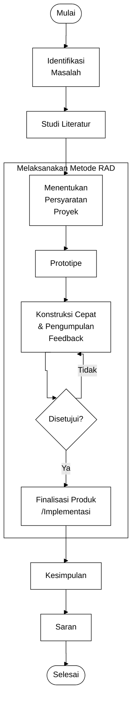

# Diagram Alur Metode RAD

```plantuml
@startuml
skinparam backgroundColor transparent
skinparam defaultFontColor black
skinparam activityBackgroundColor transparent
skinparam activityBorderColor black
skinparam activityFontColor black
skinparam activityDiamondBackgroundColor transparent
skinparam activityDiamondBorderColor black
skinparam activityDiamondFontColor black
skinparam activityArrowColor black
skinparam partitionBackgroundColor transparent
skinparam partitionBorderColor black
skinparam partitionFontColor black

start

:Identifikasi
Masalah;
:Studi Literatur;

partition "Melaksanakan Metode RAD" {
  :Menentukan
  Persyaratan
  Proyek;
  :Prototipe;

  repeat
    :Konstruksi Cepat
    & Pengumpulan
    Feedback;
  repeat while (Disetujui?) is (Tidak)

  :Finalisasi Produk
  /Implementasi;
}

:Kesimpulan;
:Saran;

stop
@enduml


```

# Diagram Alur Penelitian Modified

```plantuml
@startuml
skinparam backgroundColor transparent
skinparam defaultFontColor black
skinparam activityBackgroundColor transparent
skinparam activityBorderColor black
skinparam activityFontColor black
skinparam activityDiamondBackgroundColor transparent
skinparam activityDiamondBorderColor black
skinparam activityDiamondFontColor black
skinparam activityArrowColor black
skinparam partitionBackgroundColor transparent
skinparam partitionBorderColor black
skinparam partitionFontColor black

start

  :Menentukan
  Persyaratan
  Proyek;
  :Prototipe;

  repeat
    :Konstruksi Cepat
    & Pengumpulan
    Feedback;
  repeat while (Disetujui?) is (Tidak)

  :Finalisasi Produk
  /Implementasi;

stop
@enduml

```

# Diagram Alur Penelitian Modified - Mermaid


