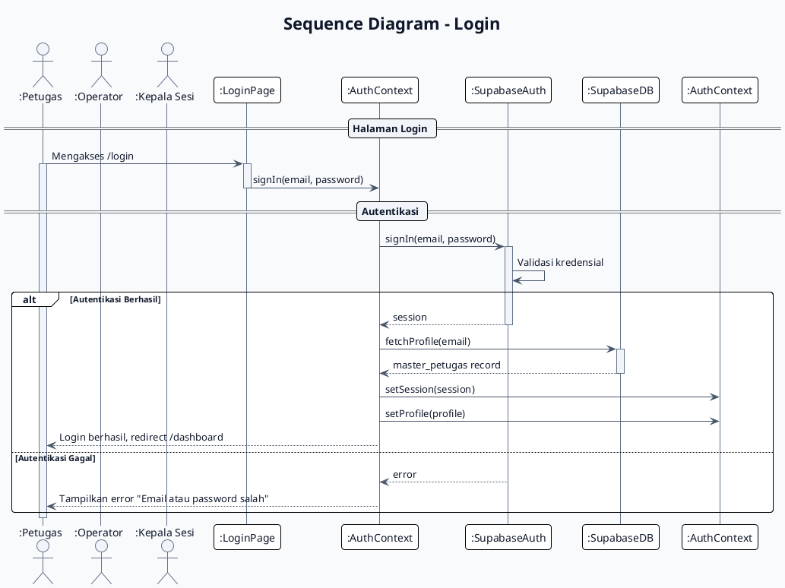
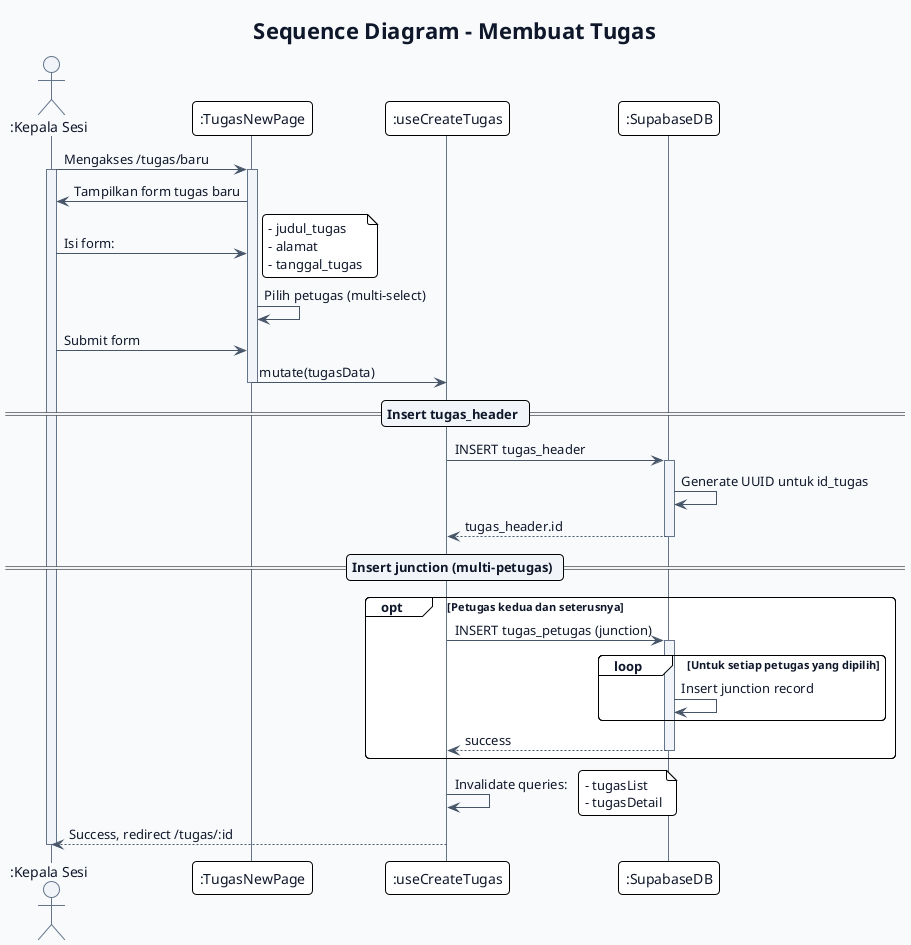
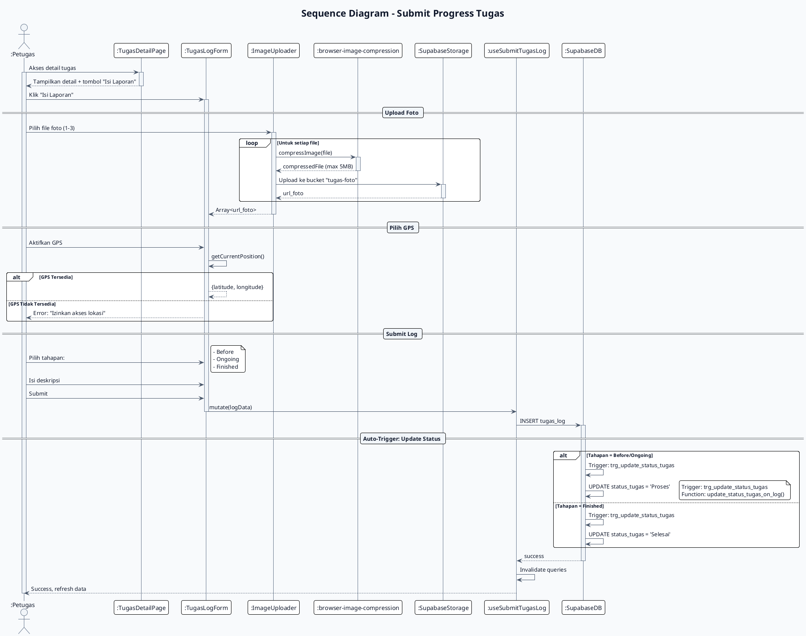
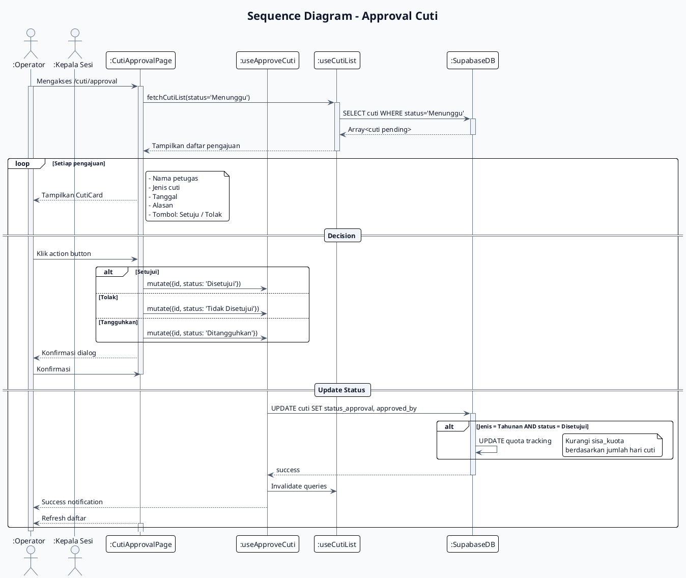
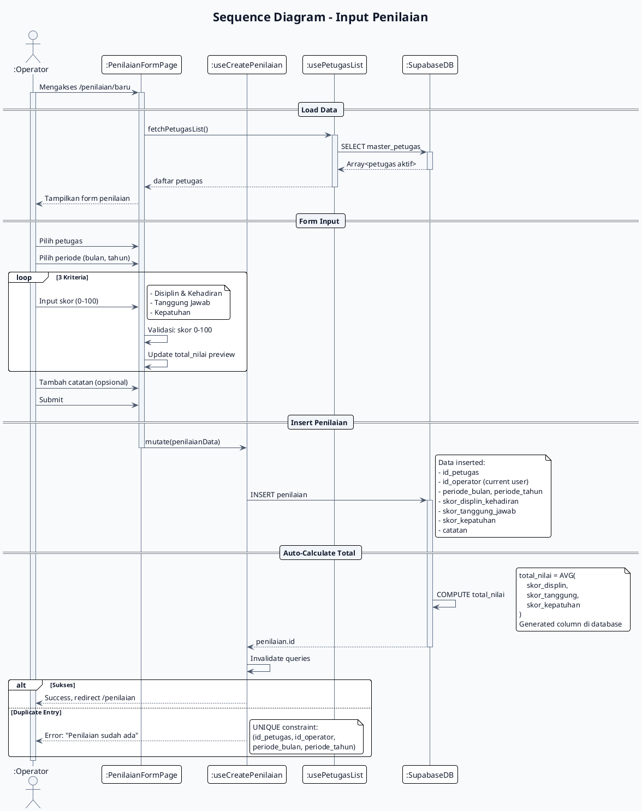

# Sequence Diagram - Sistem E-Kinerja

Dokumentasi ini berisi sequence diagram untuk alur-alur kritis dalam sistem E-Kinerja, disajikan dalam format **PlantUML** dan **Mermaid.js**.

---

## Daftar Sequence Diagram

| No  | Alur                  | File                         |
| -----| -----------------------| ------------------------------|
| 1   | Login                 | `sequence-login.md`          |
| 2   | Membuat Tugas         | `sequence-task-creation.md`  |
| 3   | Submit Progress Tugas | `sequence-task-progress.md`  |
| 4   | Pengajuan Cuti        | `sequence-leave-request.md`  |
| 5   | Approval Cuti         | `sequence-leave-approval.md` |
| 6   | Input Penilaian       | `sequence-evaluation.md`     |

---

## 1. Sequence Diagram - Login

### PlantUML



### Mermaid.js

```mermaid
sequenceDiagram
    autonumber
    title Sequence Diagram - Login

    actor PETUGAS as :Petugas
    participant LOGIN as :LoginPage
    participant AUTH as :AuthContext
    participant SUPA_AUTH as :SupabaseAuth
    participant SUPA_DB as :SupabaseDB
    participant AUTH_CTX as :AuthContext

    PETUGAS->>+LOGIN : Mengakses /login
    LOGIN->>+AUTH : signIn(email, password)

    rect rgb(240, 253, 244)
        Note over AUTH,SUPA_AUTH : Autentikasi
        AUTH->>+SUPA_AUTH : signIn(email, password)
        SUPA_AUTH-->>-AUTH : session / error
    end

    alt Autentikasi Berhasil
        AUTH->>+SUPA_DB : fetchProfile(email)
        SUPA_DB-->>-AUTH : master_petugas record
        AUTH->>AUTH_CTX : setSession(session)
        AUTH->>AUTH_CTX : setProfile(profile)
        AUTH-->>-PETUGAS : Login berhasil, redirect /dashboard
    else Autentikasi Gagal
        AUTH-->>-PETUGAS : Tampilkan error
    end

    deactivate PETUGAS
```

---

## 2. Sequence Diagram - Membuat Tugas

### PlantUML



### Mermaid.js

```mermaid
sequenceDiagram
    autonumber
    title Sequence Diagram - Membuat Tugas

    actor KEPSES as :Kepala Sesi
    participant NEW_PAGE as :TugasNewPage
    participant CREATE_HOOK as :useCreateTugas
    participant DB as :SupabaseDB

    KEPSES->>+NEW_PAGE : Mengakses /tugas/baru
    NEW_PAGE-->>-KEPSES : Tampilkan form tugas baru

    KEPSES->>+NEW_PAGE : Isi form (judul, alamat, tanggal, petugas)
    NEW_PAGE-->>-KEPSES : Form terisi

    KEPSES->>+NEW_PAGE : Submit form
    NEW_PAGE->>+CREATE_HOOK : mutate(tugasData)

    rect rgb(240, 248, 255)
        Note over CREATE_HOOK,DB : Insert tugas_header
        CREATE_HOOK->>+DB : INSERT tugas_header
        DB->>DB : Generate UUID
        DB-->>-CREATE_HOOK : tugas_header.id
    end

    rect rgb(255, 250, 240)
        Note over CREATE_HOOK,DB : Insert Junction (Multi-Petugas)
        opt Petugas > 1
            loop Untuk setiap petugas
                CREATE_HOOK->>+DB : INSERT tugas_petugas
                DB-->>-CREATE_HOOK : success
            end
        end
    end

    CREATE_HOOK->>CREATE_HOOK : Invalidate queries
    CREATE_HOOK-->>-KEPSES : Success, redirect /tugas/:id

    deactivate KEPSES
```

---

## 3. Sequence Diagram - Submit Progress Tugas

### PlantUML



### Mermaid.js

```mermaid
sequenceDiagram
    autonumber
    title Sequence Diagram - Submit Progress Tugas

    actor PETUGAS as :Petugas
    participant DETAIL as :TugasDetailPage
    participant LOG_FORM as :TugasLogForm
    participant UPLOADER as :ImageUploader
    participant COMPRESS as :browser-image-compression
    participant STORAGE as :SupabaseStorage
    participant LOG_HOOK as :useSubmitTugasLog
    participant DB as :SupabaseDB

    PETUGAS->>+DETAIL : Akses detail tugas
    DETAIL-->>-PETUGAS : Tampilkan detail + tombol

    PETUGAS->>+LOG_FORM : Klik "Isi Laporan"

    rect rgb(255, 249, 240)
        Note over PETUGAS,STORAGE : Upload Foto
        loop Untuk setiap file (1-3)
            PETUGAS->>+UPLOADER : Pilih file foto
            UPLOADER->>+COMPRESS : compressImage(file)
            COMPRESS-->>-UPLOADER : compressedFile
            UPLOADER->>+STORAGE : Upload ke bucket
            STORAGE-->>-UPLOADER : url_foto
            deactivate UPLOADER
        end
    end

    rect rgb(240, 249, 255)
        Note over PETUGAS,LOG_FORM : GPS Location
        PETUGAS->>+LOG_FORM : Aktifkan GPS
        LOG_FORM->>LOG_FORM : getCurrentPosition()
        alt GPS Tersedia
            LOG_FORM-->>LOG_FORM : {lat, lng}
        else GPS Tidak Tersedia
            LOG_FORM-->>-PETUGAS : Error
        end
    end

    PETUGAS->>+LOG_FORM : Pilih tahapan + deskripsi + Submit

    LOG_FORM->>+LOG_HOOK : mutate(logData)

    rect rgb(255, 240, 245)
        Note over LOG_HOOK,DB : Auto-Trigger: Update Status
        LOG_HOOK->>+DB : INSERT tugas_log

        alt Tahapan = Before/Ongoing
            DB->>DB : Trigger: UPDATE status = 'Proses'
        else Tahapan = Finished
            DB->>DB : Trigger: UPDATE status = 'Selesai'
        end
        DB-->>-LOG_HOOK : success
    end

    LOG_HOOK-->>-PETUGAS : Success, refresh

    deactivate PETUGAS
```

---

## 4. Sequence Diagram - Pengajuan Cuti

### PlantUML

```plantuml
@startuml
!theme plain
skinparam shadowing false
skinparam roundcorner 8
skinparam defaultFontName sans-serif
skinparam defaultFontColor #0F172A
skinparam backgroundColor #F8FAFC
skinparam ArrowColor #475569

skinparam sequence {
    ArrowColor #475569
    ActorBorderColor #64748B
    ActorBackgroundColor #F1F5F9
    BoxBackgroundColor #FFFFFF
    BoxBorderColor #64748B
    DividerBackgroundColor #F1F5F9
    LifeLineBorderColor #64748B
    LifeLineBackgroundColor #F1F5F9
    MessageArrowColor #475569
    MessageTextColor #0F172A
    NoteBackgroundColor #FEF9C3
    NoteBorderColor #CA8A04
}

title Sequence Diagram - Pengajuan Cuti

actor ":Petugas" as PETUGAS
participant ":CutiAjuanPage" as AJUAN
participant ":KuotaIndicator" as KUOTA
participant ":useKuotaCuti" as KUOTA_HOOK
participant ":useCreateCuti" as CREATE_HOOK
participant ":SupabaseStorage" as STORAGE
participant ":SupabaseDB" as DB

PETUGAS -> AJUAN : Mengakses /cuti/ajuan
activate PETUGAS
activate AJUAN

== Cek Kuota ==

AJUAN -> KUOTA_HOOK : fetchKuotaCuti()
activate KUOTA_HOOK
KUOTA_HOOK -> DB : hitung_sisa_kuota_cuti(petugas_id, tahun)
activate DB
DB --> KUOTA_HOOK : sisa_kuota (integer)
deactivate DB
KUOTA_HOOK --> KUOTA : {sisa: number, terpakai: number}
deactivate KUOTA_HOOK

KUOTA --> AJUAN : Tampilkan sisa kuota
AJUAN --> PETUGAS : Tampilkan form pengajuan

== Form Pengajuan ==

PETUGAS -> AJUAN : Pilih jenis cuti:
note right
    - Tahunan
    - Sakit
    - Alasan Penting
end note

alt Jenis = Tahunan
    AJUAN -> KUOTA : Validasi kuota
    KUOTA -> KUOTA : cek sisa_kuota >= hari_diminta

    alt Kuota Tidak Cukup
        KUOTA --> AJUAN : Error: "Kuota tidak cukup"
        AJUAN --> PETUGAS : Tampilkan error
        stop
    end
end

PETUGAS -> AJUAN : Isi tanggal mulai & selesai
PETUGAS -> AJUAN : Isi alasan

alt Upload Lampiran
    PETUGAS -> AJUAN : Upload file (PDF/image)
    AJUAN -> STORAGE : Upload ke bucket "cuti-lampiran"
    activate STORAGE
    STORAGE --> AJUAN : lampiran_url
    deactivate STORAGE
end

PETUGAS -> AJUAN : Submit pengajuan

== Insert Cuti ==

AJUAN -> CREATE_HOOK : mutate(cutiData)
deactivate AJUAN

CREATE_HOOK -> DB : INSERT cuti
activate DB

alt Jenis = Tahunan
    DB -> DB : Trigger: trg_validate_kuota_cuti
    note right
        Validasi: sisa_kuota >= hari_cuti
        Constraint: tgl_selesai >= tgl_mulai
    end note
end

DB -> DB : SET status_approval = 'Menunggu'
DB --> CREATE_HOOK : cuti.id
deactivate DB

CREATE_HOOK -> CREATE_HOOK : Invalidate queries
CREATE_HOOK --> PETUGAS : Success, redirect /cuti
deactivate CREATE_HOOK

deactivate PETUGAS

@enduml
```

### Mermaid.js

```mermaid
sequenceDiagram
    autonumber
    title Sequence Diagram - Pengajuan Cuti

    actor PETUGAS as :Petugas
    participant AJUAN as :CutiAjuanPage
    participant KUOTA as :KuotaIndicator
    participant KUOTA_HOOK as :useKuotaCuti
    participant CREATE_HOOK as :useCreateCuti
    participant STORAGE as :SupabaseStorage
    participant DB as :SupabaseDB

    PETUGAS->>+AJUAN : Mengakses /cuti/ajuan

    rect rgb(240, 248, 255)
        Note over AJUAN,DB : Cek Kuota
        AJUAN->>+KUOTA_HOOK : fetchKuotaCuti()
        KUOTA_HOOK->>+DB : hitung_sisa_kuota_cuti()
        DB-->>-KUOTA_HOOK : sisa_kuota
        KUOTA_HOOK-->>-AJUAN : {sisa, terpakai}
    end

    AJUAN-->>-PETUGAS : Tampilkan form + sisa kuota

    rect rgb(255, 240, 245)
        Note over PETUGAS,STORAGE : Validasi & Upload
        PETUGAS->>+AJUAN : Pilih jenis cuti
        alt Jenis = Tahunan
            AJUAN->>KUOTA : Validasi kuota
            alt Kuota Tidak Cukup
                KUOTA-->>-PETUGAS : Error
            end
        end
        PETUGAS->>+AJUAN : Isi form + upload lampiran (opsional)
        AJUAN->>+STORAGE : Upload ke bucket
        STORAGE-->>-AJUAN : lampiran_url
    end

    PETUGAS->>+AJUAN : Submit pengajuan

    rect rgb(240, 255, 240)
        Note over CREATE_HOOK,DB : Insert Cuti
        AJUAN->>+CREATE_HOOK : mutate(cutiData)
        CREATE_HOOK->>+DB : INSERT cuti

        alt Jenis = Tahunan
            DB->>DB : Trigger: trg_validate_kuota_cuti
        end

        DB-->>-CREATE_HOOK : cuti.id
    end

    CREATE_HOOK-->>-PETUGAS : Success, redirect /cuti

    deactivate PETUGAS
```

---

## 5. Sequence Diagram - Approval Cuti

### PlantUML



### Mermaid.js

```mermaid
sequenceDiagram
    autonumber
    title Sequence Diagram - Approval Cuti

    actor OPERATOR as :Operator
    actor KEPSES as :Kepala Sesi
    participant APPROVAL as :CutiApprovalPage
    participant LIST_HOOK as :useCutiList
    participant APPROVE_HOOK as :useApproveCuti
    participant DB as :SupabaseDB

    OPERATOR->>+APPROVAL : Mengakses /cuti/approval

    rect rgb(240, 248, 255)
        Note over APPROVAL,DB : Fetch Pending
        APPROVAL->>+LIST_HOOK : fetchCutiList(status='Menunggu')
        LIST_HOOK->>+DB : SELECT cuti WHERE status='Menunggu'
        DB-->>-LIST_HOOK : Array<cuti pending>
        LIST_HOOK-->>-APPROVAL : Tampilkan daftar
    end

    loop Setiap pengajuan
        APPROVAL-->>-OPERATOR : Tampilkan CutiCard

        OPERATOR->>+APPROVAL : Pilih action

        rect rgb(255, 250, 240)
            Note over APPROVAL,DB : Update Status
            alt Setujui
                APPROVAL->>+APPROVE_HOOK : mutate({status: 'Disetujui'})
            else Tolak
                APPROVAL->>+APPROVE_HOOK : mutate({status: 'Tidak Disetujui'})
            else Tangguhkan
                APPROVAL->>+APPROVE_HOOK : mutate({status: 'Ditangguhkan'})
            end

            OPERATOR->>APPROVAL : Konfirmasi

            APPROVAL->>+DB : UPDATE cuti
            DB->>DB : Update quota jika Disetujui & Tahunan
            DB-->>-APPROVAL : success
            deactivate APPROVAL
        end

        APPROVE_HOOK-->>-OPERATOR : Success notification
    end

    deactivate OPERATOR
```

---

## 6. Sequence Diagram - Input Penilaian

### PlantUML



### Mermaid.js

```mermaid
sequenceDiagram
    autonumber
    title Sequence Diagram - Input Penilaian

    actor OPERATOR as :Operator
    participant FORM as :PenilaianFormPage
    participant PETUGAS_HOOK as :usePetugasList
    participant CREATE_HOOK as :useCreatePenilaian
    participant DB as :SupabaseDB

    OPERATOR->>+FORM : Mengakses /penilaian/baru

    rect rgb(240, 248, 255)
        Note over FORM,DB : Load Data
        FORM->>+PETUGAS_HOOK : fetchPetugasList()
        PETUGAS_HOOK->>+DB : SELECT master_petugas
        DB-->>-PETUGAS_HOOK : Array<petugas aktif>
        PETUGAS_HOOK-->>-FORM : daftar petugas
    end

    FORM-->>-OPERATOR : Tampilkan form

    rect rgb(255, 250, 240)
        Note over OPERATOR,DB : Input & Calculate
        loop 3 Kriteria Penilaian
            OPERATOR->>+FORM : Input skor (0-100)
            FORM->>FORM : Validasi + Preview
        end
    end

    OPERATOR->>+FORM : Submit

    rect rgb(240, 255, 240)
        Note over CREATE_HOOK,DB : Insert & Calculate
        FORM->>+CREATE_HOOK : mutate(penilaianData)
        CREATE_HOOK->>+DB : INSERT penilaian
        DB->>DB : COMPUTE total_nilai = AVG(skor_1, skor_2, skor_3)
        DB-->>-CREATE_HOOK : penilaian.id
    end

    alt Sukses
        CREATE_HOOK-->>-OPERATOR : Success, redirect
    else Duplicate
        CREATE_HOOK-->>-OPERATOR : Error: sudah ada
    end

    deactivate OPERATOR
```

---

## Legenda Simbol

### PlantUML

| Simbol | Arti |
|--------|------|
| `actor` | Pengguna atau sistem eksternal |
| `participant` | Komponen dalam sistem |
| `->` | Pesan sinkron |
| `-->` | Pesan return |
| `->>` | Asynchronous message |
| `activate/deactivate` | Aktivasi lifecycle |
| `alt/else/opt` | Fragmen bersyarat |
| `loop` | Fragmen berulang |
| `note` | Catatan |

### Mermaid.js

| Simbol | Arti |
|--------|------|
| `actor` | Pengguna |
| `participant` | Komponen |
| `->>` | Arrow dengan arrowhead |
| `-->>` | Dashed arrow |
| `loop` | Loop fragment |
| `alt/else` | Alternative fragment |
| `opt` | Optional fragment |
| `rect rgb()` | Background color |
| `Note over` | Catatan spanning |
| `autonumber` | Nomor otomatis |

---

## Alur Bisnis Summary

| No | Alur | Actor Utama | Modul |
|----|------|-------------|-------|
| 1 | Login | Petugas/Operator/Kepala Sesi | Auth |
| 2 | Membuat Tugas | Kepala Sesi | Tugas |
| 3 | Submit Progress | Petugas | Tugas |
| 4 | Pengajuan Cuti | Petugas | Cuti |
| 5 | Approval Cuti | Operator/Kepala Sesi | Cuti |
| 6 | Input Penilaian | Operator | Penilaian |
