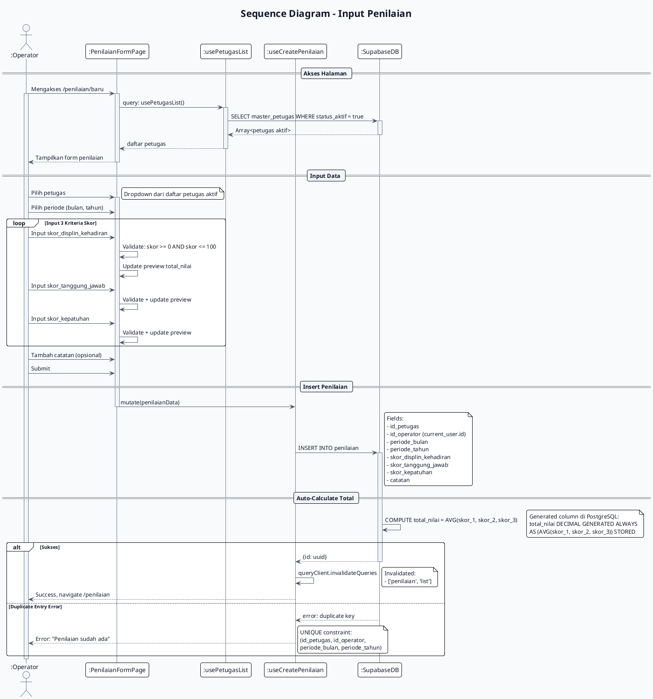

# Sequence Diagram - Input Penilaian
# Sistem E-Kinerja

## PlantUML



## Mermaid.js

```mermaid
sequenceDiagram
    autonumber
    title Sequence Diagram - Input Penilaian

    actor OPERATOR as :Operator
    participant FORM as :PenilaianFormPage
    participant PETUGAS_HOOK as :usePetugasList
    participant CREATE_HOOK as :useCreatePenilaian
    participant DB as :SupabaseDB

    OPERATOR->>+FORM : Mengakses /penilaian/baru

    rect rgb(240, 248, 255)
        Note over FORM,DB : Load Petugas List
        FORM->>+PETUGAS_HOOK : usePetugasList()
        PETUGAS_HOOK->>+DB : SELECT master_petugas
        DB-->>-PETUGAS_HOOK : Array<petugas aktif>
        PETUGAS_HOOK-->>-FORM : daftar petugas
    end

    FORM-->>-OPERATOR : Tampilkan form

    rect rgb(255, 250, 240)
        Note over OPERATOR,FORM : Input Data
        OPERATOR->>+FORM : Pilih petugas + periode

        loop 3 Kriteria Skor
            OPERATOR->>FORM : Input skor (0-100)
            FORM->>FORM : Validate + preview total
        end
    end

    OPERATOR->>+FORM : Submit

    rect rgb(240, 255, 240)
        Note over CREATE_HOOK,DB : Insert + Calculate
        FORM->>+CREATE_HOOK : mutate(penilaianData)
        CREATE_HOOK->>+DB : INSERT INTO penilaian

        DB->>DB : COMPUTE total_nilai = AVG(skor_1, skor_2, skor_3)

        alt Sukses
            DB-->>-CREATE_HOOK : {id: uuid}
        else Duplicate
            DB-->>-CREATE_HOOK : error: duplicate key
        end
    end

    alt Sukses
        CREATE_HOOK->>CREATE_HOOK : Invalidate queries
        CREATE_HOOK-->>-OPERATOR : Success, navigate /penilaian
    else Duplicate
        CREATE_HOOK-->>-OPERATOR : Error: sudah ada
    end

    deactivate OPERATOR
```

## Deskripsi Alur

| Step | Aksi | Komponen |
|------|------|----------|
| 1 | Akses halaman input penilaian | PenilaianFormPage |
| 2 | Fetch daftar petugas aktif | usePetugasList |
| 3 | Pilih petugas dan periode | Form |
| 4 | Input 3 skor kriteria | Form |
| 5 | Real-time preview total nilai | Form |
| 6 | Submit data | useCreatePenilaian |
| 7 | Insert ke database | SupabaseDB |
| 8 | Auto-compute total_nilai | PostgreSQL Generated Column |
| 9 | Invalidate cache + redirect | TanStack Query |

## Kriteria Penilaian

| Kriteria | Field | Range |
|----------|-------|-------|
| Disiplin dan Kehadiran | skor_displin_kehadiran | 0 - 100 |
| Tanggung Jawab | skor_tanggung_jawab | 0 - 100 |
| Kepatuhan | skor_kepatuhan | 0 - 100 |

## Formula Perhitungan

```sql
total_nilai = (skor_displin + skor_tanggung + skor_kepatuhan) / 3
```

atau menggunakan PostgreSQL:

```sql
total_nilai DECIMAL GENERATED ALWAYS
    AS ((skor_displin + skor_tanggung + skor_kepatuhan) / 3) STORED
```

## Validasi Checklist

| Field | Rule |
|-------|------|
| id_petugas | Required, UUID valid |
| id_operator | Auto-set dari current user |
| periode_bulan | Required, integer 1-12 |
| periode_tahun | Required, integer YYYY |
| skor_* | Required, decimal 0.00 - 100.00 |
| catatan | Optional, text |

## Business Rules

1. **UNIQUE Constraint**: (id_petugas, id_operator, periode_bulan, periode_tahun)
2. **Auto-Generated**: total_nilai dihitung otomatis oleh PostgreSQL
3. **Role-Based**: Hanya Operator yang bisa input penilaian
4. **Periode**: Setiap petugas bisa dinilai 1x per periode oleh 1 operator
