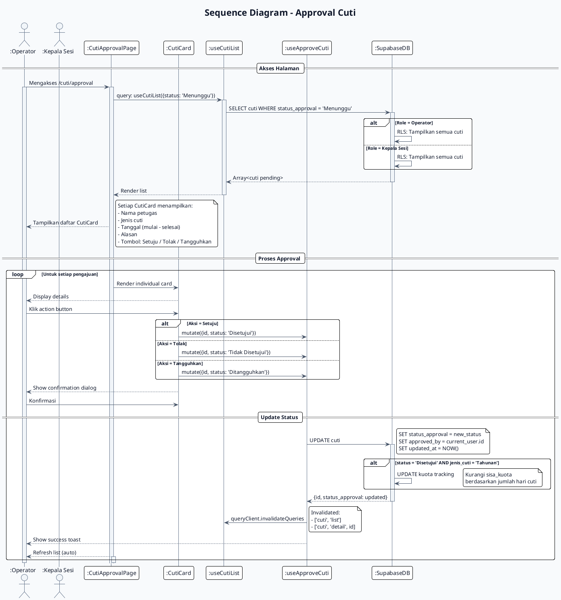

# Sequence Diagram - Approval Cuti
# Sistem E-Kinerja

## PlantUML



## Mermaid.js

```mermaid
sequenceDiagram
    autonumber
    title Sequence Diagram - Approval Cuti

    actor OPERATOR as :Operator
    actor KEPSES as :Kepala Sesi
    participant PAGE as :CutiApprovalPage
    participant CARD as :CutiCard
    participant LIST_HOOK as :useCutiList
    participant APPROVE_HOOK as :useApproveCuti
    participant DB as :SupabaseDB

    OPERATOR->>+PAGE : Mengakses /cuti/approval

    rect rgb(240, 248, 255)
        Note over PAGE,DB : Fetch Pending List
        PAGE->>+LIST_HOOK : useCutiList({status: 'Menunggu'})
        LIST_HOOK->>+DB : SELECT cuti WHERE status='Menunggu'
        DB-->>-LIST_HOOK : Array<cuti pending>
        LIST_HOOK-->>-PAGE : Render list
    end

    PAGE-->>-OPERATOR : Tampilkan CutiCard list

    loop Untuk setiap pengajuan

        PAGE->>+CARD : Render card
        CARD-->>-OPERATOR : Display details

        OPERATOR->>+CARD : Klik action

        rect rgb(255, 250, 240)
            Note over CARD,DB : Update Status
            alt Setuju
                CARD->>+APPROVE_HOOK : mutate({status: 'Disetujui'})
            else Tolak
                CARD->>+APPROVE_HOOK : mutate({status: 'Tidak Disetujui'})
            else Tangguhkan
                CARD->>+APPROVE_HOOK : mutate({status: 'Ditangguhkan'})
            end

            OPERATOR->>CARD : Konfirmasi
            CARD->>+DB : UPDATE cuti

            alt Disetujui & Tahunan
                DB->>DB : UPDATE kuota
            end

            DB-->>-APPROVE_HOOK : success
        end

        APPROVE_HOOK-->>-OPERATOR : Toast notification
    end

    PAGE->>PAGE : Refresh list
    deactivate PAGE

    deactivate OPERATOR
```

## Deskripsi Alur

| Step | Aksi | Komponen |
|------|------|----------|
| 1 | Akses halaman approval | CutiApprovalPage |
| 2 | Fetch daftar cuti pending | useCutiList |
| 3 | Tampilkan CutiCard per pengajuan | CutiCard |
| 4 | Review detail pengajuan | Card UI |
| 5 | Pilih aksi (Setuju/Tolak/Tangguhkan) | useApproveCuti |
| 6 | Konfirmasi aksi | Confirmation Dialog |
| 7 | Update status di database | SupabaseDB |
| 8 | Update kuota jika Disetujui + Tahunan | Database trigger |
| 9 | Invalidate cache + show toast | TanStack Query |

## Status Approval

| Status | Arti | Efek ke Kuota |
|--------|------|---------------|
| Menunggu | Pending review | - |
| Disetujui | Approved | Kurangi kuota (jika Tahunan) |
| Ditangguhkan | On hold | - |
| Tidak Disetujui | Rejected | - |

## Aktor yang Bisa Approval

| Role | Hak Approval |
|------|-------------|
| Operator | Ya |
| Kepala Sesi | Ya |
| Petugas | Tidak |

## Validasi Checklist

| Field | Rule |
|-------|------|
| id | Required, UUID valid |
| status | Enum: Disetujui, Ditangguhkan, Tidak Disetujui |
| approved_by | Auto-set dari current user |
| updated_at | Auto-set ke NOW() |

## Business Rules

1. **RLS Policy**: Hanya Operator & Kepala Sesi bisa melihat semua pengajuan
2. **Kuota Update**: Jika Disetujui dan jenis 'Tahunan', kurangi sisa_kuota
3. **Audit Trail**: Simpan approved_by dan updated_at
4. **Real-time**: List auto-refresh setelah action
