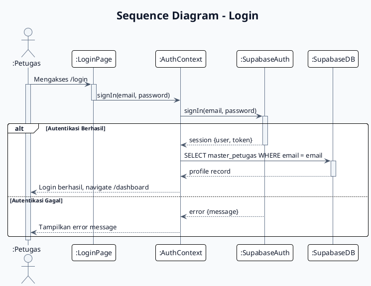

# Sequence Diagram - Login
# Sistem E-Kinerja

## PlantUML



## Mermaid.js

```mermaid
sequenceDiagram
    autonumber
    title Sequence Diagram - Login

    actor PETUGAS as :Petugas
    participant LOGIN as :LoginPage
    participant AUTH as :AuthContext
    participant SUPA_AUTH as :SupabaseAuth
    participant SUPA_DB as :SupabaseDB

    PETUGAS->>+LOGIN : Mengakses /login

    LOGIN->>+AUTH : signIn(email, password)
    AUTH->>+SUPA_AUTH : signIn(email, password)

    alt Autentikasi Berhasil
        SUPA_AUTH-->>-AUTH : session {user, token}
        AUTH->>+SUPA_DB : SELECT master_petugas
        SUPA_DB-->>-AUTH : profile record
        AUTH-->>-PETUGAS : Login berhasil, navigate /dashboard
    else Autentikasi Gagal
        SUPA_AUTH-->>-AUTH : error {message}
        AUTH-->>-PETUGAS : Tampilkan error
    end

    deactivate PETUGAS
```

## Deskripsi Alur

| Step | Aksi | Komponen |
|------|------|----------|
| 1 | User mengakses halaman login | LoginPage |
| 2 | Submit form email & password | LoginPage |
| 3 | Panggil signIn dari Supabase Auth | AuthContext |
| 4 | Supabase validasi kredensial | SupabaseAuth |
| 5 | Jika berhasil, fetch profile dari database | SupabaseDB |
| 6 | Set session & profile ke AuthContext | AuthContext |
| 7 | Redirect ke dashboard | - |
