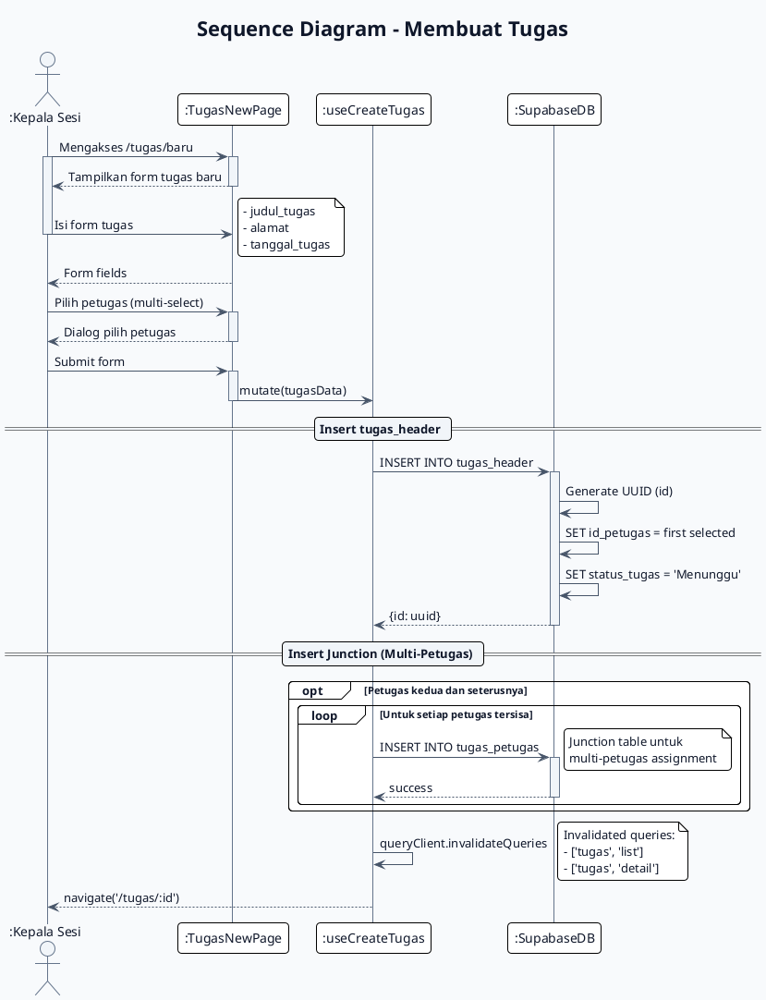

# Sequence Diagram - Membuat Tugas
# Sistem E-Kinerja

## PlantUML



## Mermaid.js

```mermaid
sequenceDiagram
    autonumber
    title Sequence Diagram - Membuat Tugas

    actor KEPSES as :Kepala Sesi
    participant NEW_PAGE as :TugasNewPage
    participant CREATE_HOOK as :useCreateTugas
    participant DB as :SupabaseDB

    KEPSES->>+NEW_PAGE : Mengakses /tugas/baru
    NEW_PAGE-->>-KEPSES : Tampilkan form

    KEPSES->>+NEW_PAGE : Isi form + pilih petugas
    NEW_PAGE-->>-KEPSES : Form terisi

    KEPSES->>+NEW_PAGE : Submit form

    NEW_PAGE->>+CREATE_HOOK : mutate(tugasData)

    rect rgb(240, 248, 255)
        Note over CREATE_HOOK,DB : Insert tugas_header
        CREATE_HOOK->>+DB : INSERT INTO tugas_header
        DB->>DB : Generate UUID, set status='Menunggu'
        DB-->>-CREATE_HOOK : {id: uuid}
    end

    rect rgb(255, 250, 240)
        Note over CREATE_HOOK,DB : Insert Junction
        opt Petugas > 1
            loop Untuk setiap petugas
                CREATE_HOOK->>+DB : INSERT INTO tugas_petugas
                DB-->>-CREATE_HOOK : success
            end
        end
    end

    CREATE_HOOK->>CREATE_HOOK : Invalidate queries
    CREATE_HOOK-->>-KEPSES : navigate('/tugas/:id')

    deactivate KEPSES
```

## Deskripsi Alur

| Step | Aksi | Komponen |
|------|------|----------|
| 1 | Kepala Sesi akses halaman buat tugas | TugasNewPage |
| 2 | Isi form: judul, alamat, tanggal | Form |
| 3 | Pilih petugas (multi-select via dialog) | MultiSelect Dialog |
| 4 | Submit form | Form |
| 5 | Insert ke tugas_header | SupabaseDB |
| 6 | Insert junction untuk petugas tambahan | SupabaseDB |
| 7 | Invalidate TanStack Query cache | useCreateTugas |
| 8 | Redirect ke detail tugas | React Router |

## Business Rules

| Rule | Detail |
|------|--------|
| ID Generation | UUID auto-generated |
| Status Awal | 'Menunggu' |
| Multi-Petugas | via junction table tugas_petugas |
| Required Fields | judul_tugas, tanggal_tugas |
